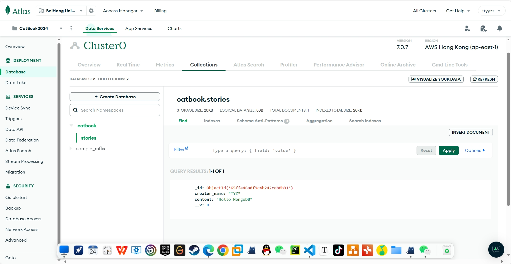

## WEB.lab

## LECTURE

#### LEC08 React

- React!
- prop/state
- JSX
  - stricter version of HTML
  - Return JSX = what the React component should render
  - () allows us to write JSX ("HTML") code inside JavaScript
  - {} allows us to return to JavaScript inside the JSX environment to use
    variables defined inside this React Component
- A tree of **components**.
- We pass in props with `<Post text="I love weblab" />`
- We read in those props with `props.text`
- The power of React is **REUSE**.
  - It creates the component, a more higher abstraction.
    - HTML only provides some basic elements like ul.
    - With React, We can create a <Intro>, a <Post>...

#### LEC09 Design, UI/UX, Figma

- User Interface(UI)
  - fonts
  - color palettes
  - shapes + layout
  - etc.
  - UI trends change over time.
- User Experience(UX)
- Figma to create the prototype

#### LEC11 Intro to APIs and Promises

- **API**(Application Program Interface)

  - Simply a set of endpoints a service allows you to make requests to
  - By accessing a URL, you are making a request to an endpoint

- The following request returns driving directions from Toronto, Ontario to Montreal, Quebec

```html
https://maps.googleapis.com/maps/api/directions/json ?destination=Montreal
&origin=Toronto &key=YOUR_API_KEY
```

- We need a API key, it is used for charge or rate limit.
- Promise: allows for asynchronous processing

```javascript
get("/api/stories")
  // Promise is accepted.
  .then((storyObjs) => {
    setStories(storyObjs);
  })
  // Promise is rejected.
  .catch((err) => {
    console.log("this is so bad: ", err.message);
  });
```

- It's useful in web. When we send a request, we can't predict when the response returns.
- The only thing we can do is to assign task to two situations: accepted/rejected.

#### LEC 12 React Lifecycle and Hooks

- When should you break a component down into smaller parts?
  1. The component code is getting too long or hard-to-read
  2. The component contains parts or sections (usually reusable) that have their own functionality
  3. The component is handling too many responsibilities
- State
  - Maintained by the component it is defined in
    - **you canNOT edit a component’s state from another component**
  - Mutable
  - Can be updated by either **human** inputs or **computer** inputs
  - Give us control over what is displayed in the application
- Props
  - Be passed in from parent to children **ONLY**
  - Immutable
  - Can be updated whenever the parent passes in new props
  - Renders a skeleton with **custom** content
- useState isn't enough.
  - setState is async!
  - 当您调用 useState 来更新状态时，React 会对该状态进行更新，但并不保证立即生效。React 会对更新进行批处理，以提高性能。
  - setState 之所以会设置成异步是为了合并短时间内的多次渲染
- **useEffect() hook**
  - Runs after specific variables change
  - Typically used to synchronize with something external to React
  - Syntax: `useEffect(function, optional dependency array)`
  - 
- React uses key as an optimization technique to identify which items have changed, are added, or are removed.
- If JSX objects are keyed, then React doesn’t have to re-render everything when an item is changed.
- Conditional Render

```javascript
<span className="ToDoItem-ItemContent">
  {isChecked ? (
    <del className="ToDoItem-del">{props.content}</del>
  ) : (
    // <>{props.content}</> is also fine.
    props.content
  )}
</span>
```

- Render an array of data

```javascript
const data = [
  { id: 0, text: "Hello React" },
  { id: 1, text: "Hello Vue" },
];

return data.map((item) => (
  <ItemComponent key={item.id}>{item.text}</ItemComponent>
));
```

#### LEC15 Servers, Node, and NPM

- How to write a server?
  - Listen to ports, send requests...
  - Use **framework**!
  - Apache(java), Express(Node.js), Django(Python)
  - In this course, we use **Express**!
- Node Package Manager(npm)
  - Is is used to install and handle dependencies/packages.
  - `package.json` holds project’s metadata.
  - `node_modules` contains **imported code**.
- Express
  
  - Middlewares are called in order of definition
  - Middleware in Express are functions that come into play **after the server receives the request and before the response is sent to the client**
  - We can use middleware functions for different types of processing tasks required for fulfilling the request like modifying requests or responses and handling errors.
  - e.g. preprocessing requests, parsing requests as JSON, serving static content, calling the next middleware function in the chain

#### LEC17 Advanced CSS & Other Libraries

- CSS combinator
  - Descendant selector(space)
    - `.container div`: All the div elements that are descendants of the .container element
  - Child selector(>)
    - `.container > div`: Direct div children of the .container
  - Adjacent Sibling selector(+)
    - `#c1 + div`: **Single** div after the element with an id "c1"
  - General Sibling selector(~)
    - `#c1 ~ div`: all div after the element with an id "c1"
- Display types
  - grid
- Content overflow
  - The overflow property allows us to tell the browser how to handle child elements that may exceed the size of a parent element.
  - visible(default)/hidden/scroll(a scroll bar)/auto(if overflow use scroll)
- Animations
- CSS library(Tailwind here)
  - play.tailwindcss.com

```html
<section class="w-full bg-gray-900 p-4">
  <div class="flex justify-between">
    <p class="text-white">Close</p>
    <p class="font-semibold text-blue-400">Drafts</p>
  </div>
  <div class="flex h-48 gap-4 py-8">
    <div class="aspect-square h-16 w-16 rounded-full bg-blue-400"></div>
    <textarea
      class="mt-4 w-full bg-transparent text-2xl text-white focus:outline-none"
      placeholder="What is happening?"
    ></textarea>
  </div>
  <p class="font-bold text-blue-400">Everyone can reply</p>
  <hr class="my-4 border-gray-500" />
  <nav class="flex items-center justify-between">
    <div class="flex gap-4 text-blue-400">
      <p>Image</p>
      <p>Polll</p>
      <p>Emoji</p>
      <p>Location</p>
    </div>
    <button class="rounded-full bg-blue-400 px-4 py-2 font-bold text-white">
      Post
    </button>
  </nav>
</section>
```

#### LEC18 Promises cont. and Await

- Chaining promises
  - .then() returns a promise, so we can do .then() again, and again, and again… (same goes for .catch())
- Async/Await
  - Anything you do with promises can be rewritten with async await notation
  - Await waits for the promise to resolve and uses that value
  - Await throws an exception when the promise doesn’t resolve
  - Only asynchronous functions can use await

```javascript
const myFunc = async () => {
  console.log((await a) + (await b));
};
myFunc();
```

- Why async?
  - [JS Event loop](http://t.csdnimg.cn/D5Hv4)
- When use async?
  - Communicate between different devices
    

#### LEC19 Intro to Databases

- Start from catbook-react w5
- Why we don't put the stories in the memory?
  1. If the server down, all data loses.
  2. Data may be too large.
- Why we just use a .txt to store the stories?
  1. Still keep data in memory
  2. Query speed
  3. Disk may be dead.
  4. Concurrency issues
- Use DATABASE!
- Kind of DBs
  - Relational db
  - Document db
    - Store data in JSON-like documents.
- Use MongoDB Atlas!

  - Run MongoDB in the cloud.
  - Workshop6

  

#### LEC26 Typescript

- Javascript + Interface/Static typing/Generic types and more...

#### LEC30 Web3

- Pass

#### LEC31 Svelte

- A popular framework, Skip

#### LEC32 State Management in React

- Some complex techniques to manage the state, Skip

#### LEC33 Serverless with Next.js

- Next.js is a framework built upon React that allows developers to build full-stack applications without worrying about the server architecture

#### LEC35 How to deploy

- Use render
- However, render needs a US card. So skip.
- [npm run build](https://juejin.cn/s/npm%20run%20build%E6%98%AF%E4%BB%80%E4%B9%88)
  - Generate `bundle.js`

## Workshop

#### Workshop0

- [Google font](https://fonts.google.com/) to find a nice font.
  - Just import in the css
  - Then add `body { font-family: "...", sans-serif; }`
- CSS variable
  - `:root { --x: 8px; }`

#### Workshop1

- _live server_, an extension which can automatically load the changes.
- `setInterval()`

#### Workshop2

- State
  - `const [catHappiness, setCatHappiness] = useState(0);`
- React use className

#### Workshop3

- Use some APIs
- Use Router and Link `import { Router, Link } from "@reach/router";`

#### Workshop5

- Use Express Router

```javascript
// api.js
const router = express.Router();
router.get("/stories", (req, res) => {
  res.send(data.stories);
});
router.post("/story", (req, res) => {
  const newStory = {
    _id: data.stories.length,
    creator_name: "TYZ",
    content: req.body.content,
  };
  data.stories.push(newStory);
  // Don't forget this
  res.send(data.stories);
});
module.exports = router;
// server.js
const app = express();
const api = require("./api.js");
app.use("/api", api);
```

- When handling get, the information is in `req.query`
  - `http://.../?parent=1`
- When handling post, the information is in `req.body`

- Write some apis

#### Workshop6

- Why MongoDB?
  - Efficient when we need to **write a lot** to the database
  - The structure of the data is very prone to changes(Flexible)
- MongoDB structure
  - MongoDB instance: a group of databases
  - Database: a group of collections
  - Collection: a group of very similar pieces of data
    - Ideally want all data to have the same structure(aka same keys and types)
  - Document: a single JSON or javascript object
  - Field: an attribute, a key of document
  - Think Mysql(Instance/db/table/row/column)
- Mongoose
  - Mongoose schemas: provide the organization of data.
  - Mongoose models

#### Workshop7 Authentication

- Store user name and passwd directly in DB?
  - NO! Not secure.
  - Use hash
- This course: Let Google do it.
- But how do we prove to website that we logged in to Google?
- How do we prove to website that we already logged in?
  - Session and tokens
    
- The earlier Google Sign-In JavaScript platform library for Web is deprecated.
- `react-google-login` deprecated, so the project fails to log in...
- Use `@react-oauth/google`

  - [Look at this guide](https://medium.com/@sahadmuhammed289/react-js-a-step-by-step-guide-to-google-authentication-926d0d85edbd)
  - <del>However, still can't login. But no error...</del>
  - <del>After changing, i can login, but auth also has problems...</del>

- Solved.
- Apply a new ClientID.
- [Use credential](https://livefiredev.com/in-depth-guide-sign-in-with-google-in-a-react-js-application/)
- **Add the proxy!!**

```javascript
process.env.http_proxy = "http://127.0.0.1:7890";
process.env.HTTPS_PROXY = "http://127.0.0.1:7890";
```

- Two ways to hide the variable
  1. Use `config.js` in the frone-end
  2. Use `dotenv` in the back-end
- When remembering the catHappiness, meet many pitfalls.
  1. When writing post api, **must send a res back.** Otherwise the front-end will stuck.
  - Front-end will wait for a long time.
  2. When updating the variable, using `mogoose.findByIdAndUpdate()`.
  - Note that it returns a query. So we should use `exec()` or `then()` to trigger it.
- How to handle a special case: the user logout at the profile page?
  - Don't change the front-end code which means we can still change happiness.
  - However, the back-end only write to DB when `req.user != null`.
  - Can we use props.userId to prevent user from changing happiness?
    - No. setState is async.
  - What's more, **add a link to send the user back at home after logout**.
- Write some css to beautify the logout button.

####

## HW

#### HW1

---

- [Controlled Component](http://t.csdnimg.cn/Ox4P5)
- <del>Maybe js lazy loads something</del>.
  - **We should always set State instead of assign**.

```javascript
// This does delete the element, however it will not show instantly.
const deleteItem = (nth) => {
  todos.splice(nth, 1);
};
// Correct.
const deleteItem = (nth) => {
  const newTodos = todos.slice();
  newTodos.splice(nth, 1);
  setTodos(newTodos);
};
```

## Summary

- In this course, i learn many front-end techniques: html/css/js
  - Though just a little part of them.
  - This course does many dirty work. For me, there are still too many to study.
- Learn the react: a popular framework
- Get access to the MongoDB Atlas: a DB in cloud
- How to login with Google(though fail)
- **The relations between front-end and back-end**
  - Front-end implements the UI.
    - Invoke specific API to display the data.
  - Back-end implements several APIs.
  - Back-end communicates with DB and gets data from DB.
  - Back-end passes the data to the front-end to display.
- Overall, a nice course.
